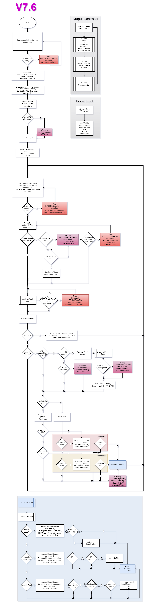

# DBC2-Battery-Charger

  Main repository for the DEIF Battery Charger - 2 products.

## Dosyalama Sistemi

`Develop` branchinde kodun çalışma garantisi yoktur fakat en son kod bulunabilir. `Main` branch' de versiyon atlatıldığında stabil kod bulunabilir.

Yazılım `Firmware` klasöründe tutulmaktadır. `Common/` tüm ürünler için ortak fonksiyonları içermektedir. Bunun yanında yer alan klasörler ise proje ismine göre ayrılmıştır.

`ENKO` ve `Documents` klasörleri geliştirme sırasında oluşturulan dökümanları tutmaktadır. Bunları bazıları müşteri ile paylaşılmıştır.

`Hardware/` donanım şema ve PCB dosyalarını içermektedir.

`Simulations` ve `Tests` klasörleri donanım için gerekli çalışmalarda oluşturulan dosyaları içermektedir. Test sonuçları `Tests/` içerisinde bulunabilir.

## Algoritma

